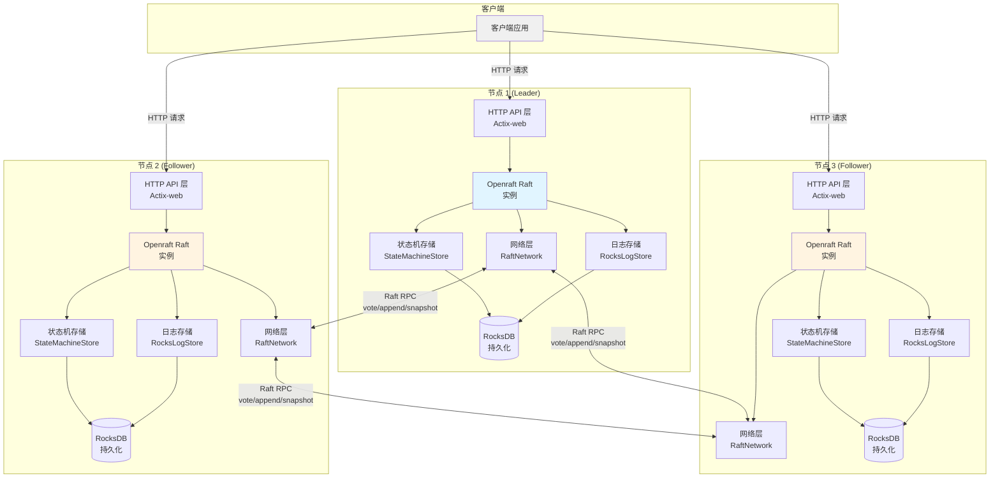

# 基于 Openraft 的分布式一致性 KV 存储服务架构

## 应用架构

### 整体架构

应用采用多节点分布式架构，每个节点运行独立的 Raft 实例，通过 Openraft 实现强一致性保证。



**核心组件：**

1. **Raft 节点** (`src/lib.rs`)
   - 每个节点包含一个 `openraft::Raft<TypeConfig>` 实例
   - 节点通过 HTTP 服务（Actix-web）暴露 RPC 和业务 API

2. **存储层** (`src/store/`)
   - **日志存储** (`RocksLogStore`): 基于 RocksDB 持久化 Raft 日志条目
   - **状态机存储** (`StateMachineStore`): 管理 KV 数据状态，实现日志应用到状态机

3. **网络层** (`src/openraft_network/`)
   - 实现 `RaftNetwork` 和 `RaftNetworkFactory`，处理节点间 RPC 通信
   - 通过 HTTP 传输 Raft 协议消息（vote、append_entries、install_snapshot）

4. **API 层** (`src/network/`)
   - **Raft RPC**: `/vote`, `/append`, `/snapshot` - 节点间通信
   - **管理 API**: `/init`, `/add-learner`, `/change-membership`, `/metrics` - 集群管理
   - **业务 API**: `/write`, `/read`, `/read-all` - KV 操作

## 实现划分

### 1. 日志存储实现

`RocksLogStore` 实现 `RaftLogStorage<TypeConfig>`：

- **持久化**: 使用 RocksDB `logs` column family 存储日志条目
- **元数据**: 使用 `meta` column family 存储 vote 和 last_purged_log_id
- **关键方法**:
  - `append()`: 追加日志条目并刷新 WAL
  - `truncate()`: 截断冲突日志
  - `purge()`: 清理已应用日志
  - `get_log_state()`: 获取日志状态

### 2. 状态机实现

`StateMachineStore` 实现 `RaftStateMachine<TypeConfig>`：

- **状态管理**: `BTreeMap<String, String>` 存储 KV 数据
- **日志应用** (`apply()`): 
  - 处理 `Put`/`Del` 请求，更新状态机
  - 处理 `Membership` 变更
  - 更新 `last_applied_log_id`
- **快照**:
  - `build_snapshot()`: 序列化状态机数据
  - `install_snapshot()`: 从快照恢复状态机

### 3. 网络层实现

`Network` 实现 `RaftNetwork<TypeConfig>`：

- **RPC 方法**:
  - `vote()`: 选举投票
  - `append_entries()`: 日志复制
  - `install_snapshot()`: 快照传输
- **通信方式**: HTTP POST 请求，JSON 序列化

## 读写流程

### 写入（Put/Delete）

`/write` API 接受 `Request` 类型的请求，支持两种操作：`Put` 用于插入或更新键值对，`Del` 用于删除指定键。 `write` 的语义是修改状态机，即添加一条 `log` 日志。

```14:16:src/network/api.rs
pub async fn write(app: Data<App>, req: Json<Request>) -> actix_web::Result<impl Responder> {
  let _response = app.raft.client_write(req.0).await.decompose().unwrap();
  Ok(Json("Ok"))
}
```

1. 客户端调用 `/write` API
2. `Raft.client_write()` 将请求追加到日志
3. Leader 复制日志到多数节点
4. 日志提交后，`apply()` 应用到状态机
5. 返回响应给客户端

### 读取

读取操作直接从状态机读取，无需经过 Raft 协议：

```19:27:src/network/api.rs
#[post("/read")]
pub async fn read(app: Data<App>, req: Json<String>) -> actix_web::Result<impl Responder> {
  let key = req.0;
  let kvs = app.key_values.read().await;
  let value = kvs.get(&key);

  let res: Result<String, Infallible> = Ok(value.cloned().unwrap_or_default());
  Ok(Json(res))
}
```

1. 客户端调用 `/read` 或 `/read-all` API
2. 直接从 `app.key_values`（状态机数据）读取
3. 返回查询结果

## 测试

`test.sh` 覆盖以下场景：

**集群初始化**：启动 3 个未初始化的节点，初始化节点 1 为单节点集群（Leader）。

**成员管理**：添加节点 2 和节点 3 为 learner，将集群从单节点 `[1]` 扩展为三节点 `[1, 2, 3]`。

**数据写入**：在 Leader 节点写入键值对，验证数据已复制到所有节点。

**数据读取**：从所有节点（Leader 和 Followers）读取数据，验证一致性。

**故障转移**：杀死 Leader 节点（节点 1），验证剩余节点选举出新 Leader，在新 Leader 上继续写入和读取。

**节点恢复**：重启节点 1，验证节点 1 能够从快照或日志恢复状态，验证恢复后数据一致性。

**删除操作**：测试删除键值对，验证删除操作在所有节点生效。
